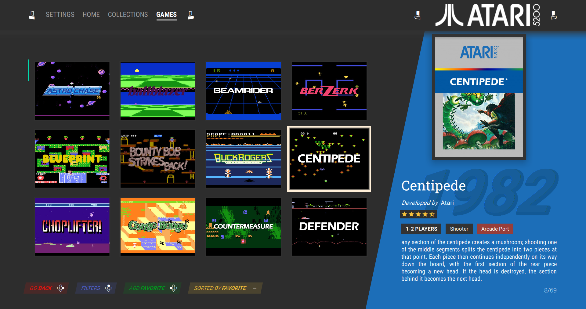
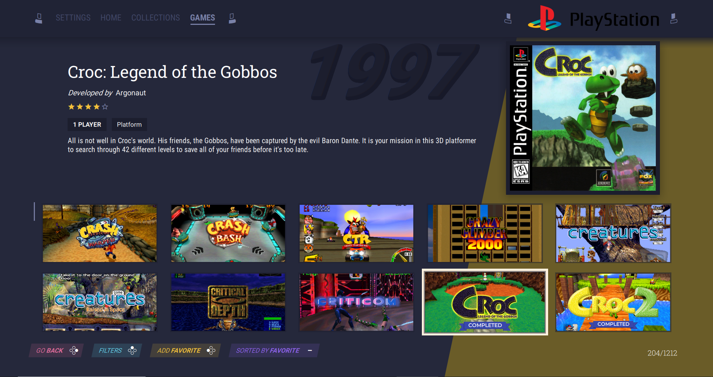

# shinretro

Current Version: [0.138](CHANGELOG.md) 

A flexible and tweakable theme for [Pegasus Frontend](http://pegasus-frontend.org).
Forked from [Valentin MEZIN](https://github.com/valsou)'s theme [neoretrō](https://github.com/valsou/neoretro) v0.131 and [Luciano Oliveira](https://github.com/luciano-work)'s dark variant.

***

  
<b>Screenshots</b>

  
  
  
  
  
  
  
  
  
  
  
  

***

  
<b>Videos</b>

  
  Theme review by [Retro Gaming Replay](https://www.youtube.com/channel/UC_9gbkxeMk3usXvSzYzimMw)
  
  

  Custom Version of [RoeTaKa](https://www.youtube.com/channel/UCAbHcM41hzH9lku_3XqFYZg) with changed collection images
  
  
  

  
***

**Contributions are welcome**

You can code and found a bug in the theme you can fix or want to add a feature to the theme?
Or you can't code but want to add translations for your native language or you can provide some awsome artwork for the theme?

Simply have the courage and make a pull request :relaxed: 
You can find some guidances [here](HACKING.md).

## Features
- selectable color schemes
`dark` `light` `ozone dark`
- costumizable game view
- different onscreen control options
`Universal (Switch like)` `XBOX` `Playstation`
- different languages support
- toggleable video playback options

and more...
You can find explanations for the theme settings [here](SETTINGS.md).
  
## Metadata in use
- boxFront
- screenshot
- titlescreen (fallback for screenshot)
- wheel
- background
- video

## Regarding videos on collection screen
> NOTE: Videos for the collection screen are not included in the theme. You can provide them by setting a default video for your collection in the Pegasus metadata of the collection. EXAMPLE:
> 
    collection: Sony Playstation 2
    shortname: ps2
    assets.video: media/videos/default.mp4

## Collection Categories
Group your collections into categories, for example by System, Series, Genre etc.
If you add a category field to your collection metadata files, the theme will allow you to switch between categories on the collection carousel screen by using the Filter button

To use this feature, add a new field 'x-collectiontype' to your collection metadata with the category you want to assign for that collection.

## Arcade Port flag
If a game is tagged as an Arcade Port, the theme will add an Arcade Port tag to the details view, next to the Players and Genre tags.

To use this feature, add a new field 'x-arcadeport' to your game metadata with a value of 'True'.

## Completed Ribbon
If you want to track which games you have finished, the theme can display a "Completed" ribbon on the grid view if a game has been marked as completed.

To use this feature, add a new field 'x-completed' to your game metadata with a value of 'True'.

## Example Metadata Files with Custom Metadata added
An example of a collection and a game entry with the custom metadata this theme can use if they are included. None of the custom metadata is required to use the theme, they are only enhancements if added.

Collection example with Collection Type added:
> 
    collection: Ace Combat
    shortname: acecombat
    sort-by: Ace Combat
    x-collectiontype: Series

Game example with custom fields added for Completed, Arcade Port:
> 
    game: Altered Beast
    file: roms\amiga\AlteredBeast_v2.0_0819.lha
    sort-title: Altered Beast
    release: 1989
    developer: Sega
    publisher: Sega
    genre: Action
    players: 2
    x-system: amiga
    rating: 0.8
    description: You are a hero raised from the dead by the god Zeus to rescue his daughter Athena. With scenery inspired by Ancient Greece, you have to fight hordes of undead and demons, with a boss at the end of each level until you meet the god Neff, who holds the girl captive.    The Altered Beast title refers to your shapeshifting abilities. In this platformer, you can collect spirit balls by defeating two-headed wolves, allowing you to mutate into different beasts such as a werewolf, a dragon, a tiger, a bear and others depending on the version. Each form, tied to a level, comes with special abilities such as flight and powerful attacks, easily superseding the basic set of punches and kicks in your human form.    The game can be played in single player mode, or in same-screen multiplayer co-op mode.
    x-completed: False
    x-arcadeport: True

## Work in progress
- [ ] clean the code...
- [ ] add more language options
- [ ] missing backgrounds/logos for collections and manufacturers 

## Considerations / ideas for the future
- [ ] provide some default collection videos
     - probalby need some original assets
- [ ] per collection fallback default background images
- [ ] filter by game genres
- [ ] add an attract mode

## Thanks to:
- [Valentin MEZIN](https://github.com/valsou) : Creator of the original neoretrō which this theme is based on
- [Luciano Oliveira](https://github.com/luciano-work) : Creator of the dark color scheme for neoretrō
- [HunkDeath](https://github.com/HunkDeath)  & [fansubmaniac](https://github.com/fansubmaniac) : french translations
- [RickEves](https://github.com/RickEves)  : portuguese translations
- [RoeTaKa](https://www.youtube.com/channel/UCAbHcM41hzH9lku_3XqFYZg)  : custom sfx & bgm music
